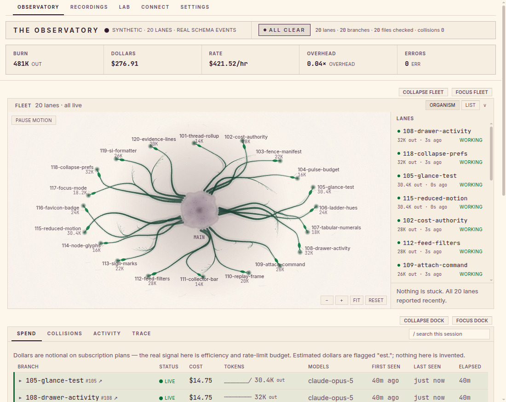
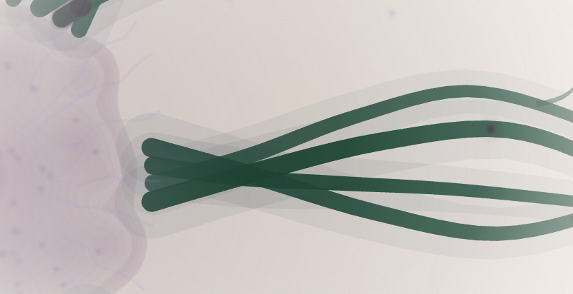
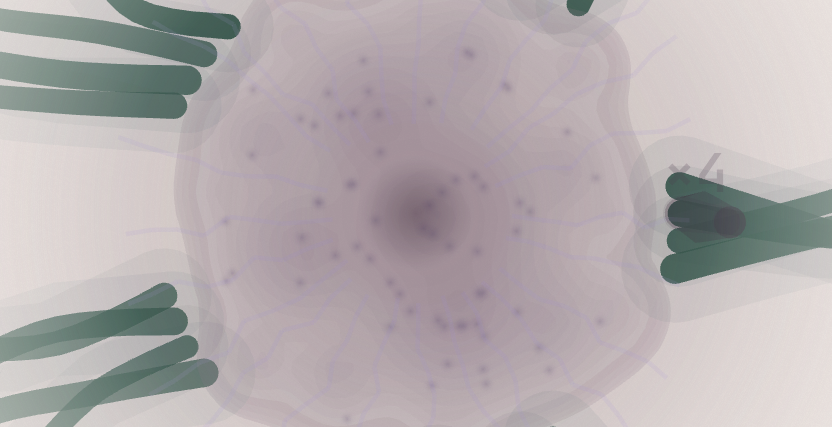
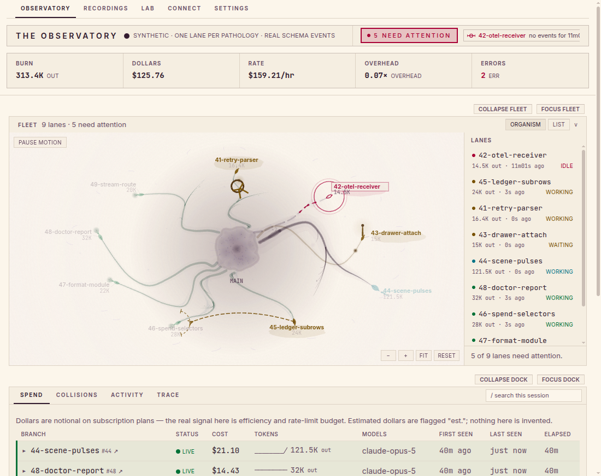
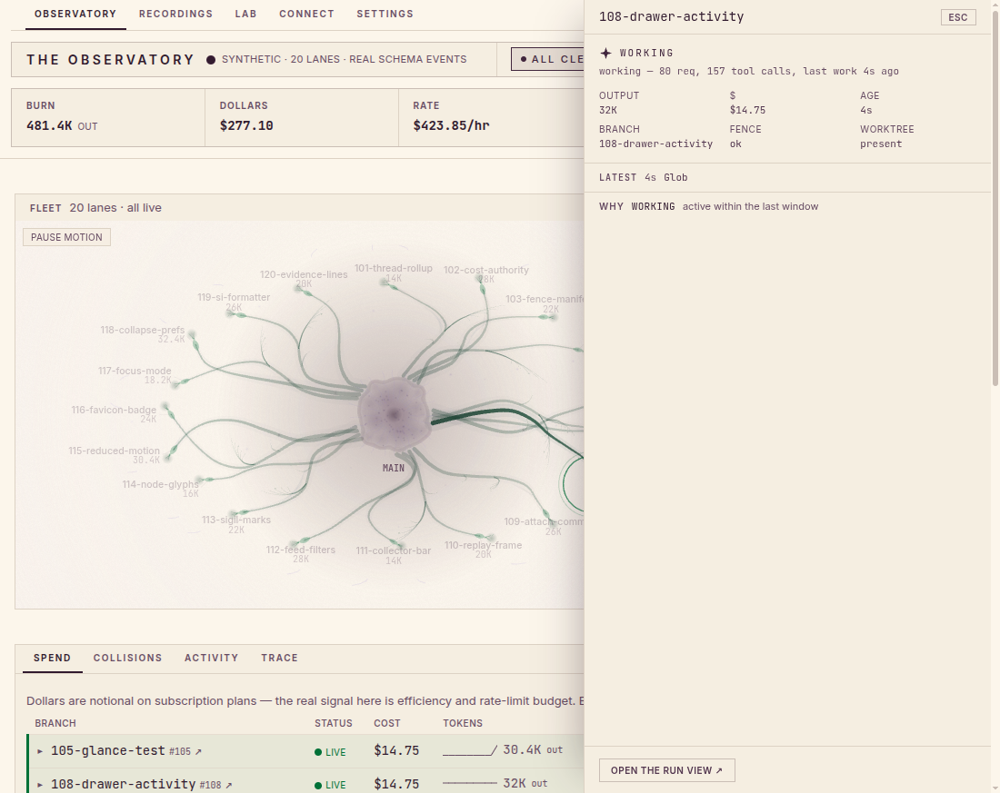
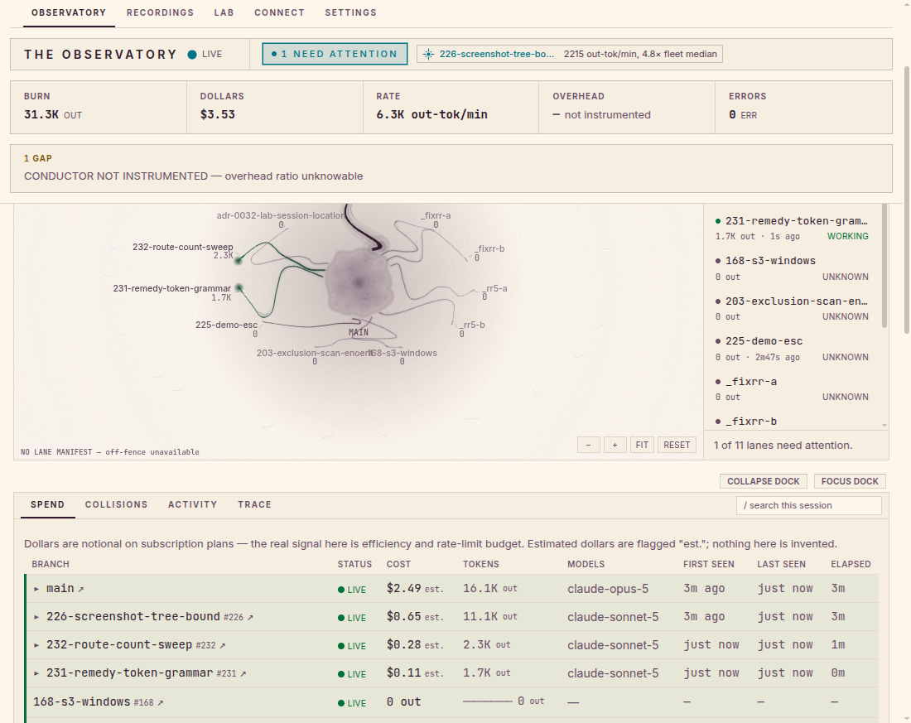
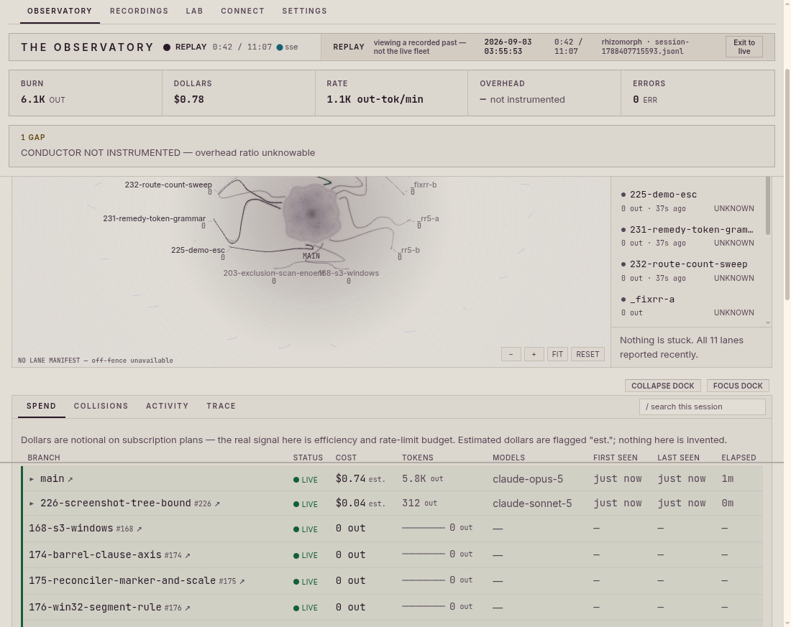
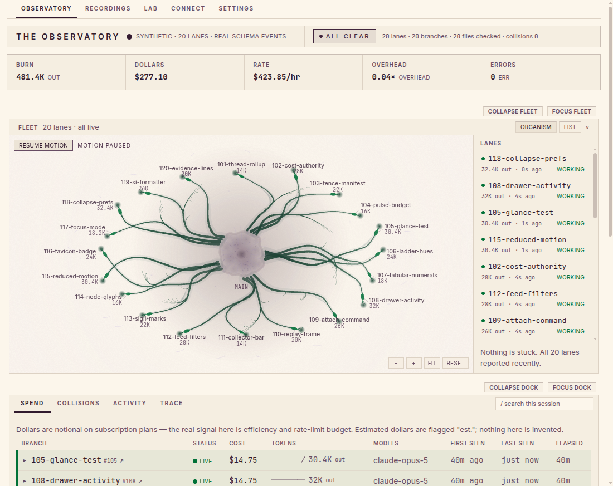
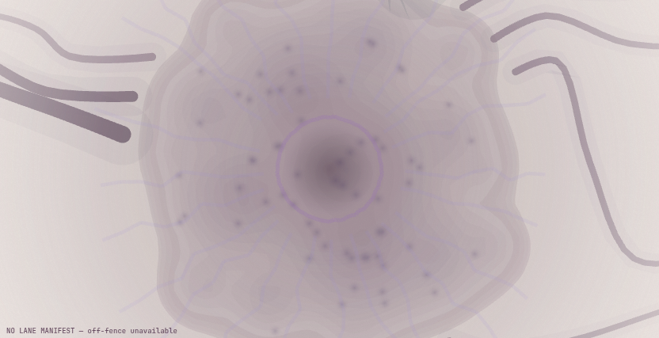
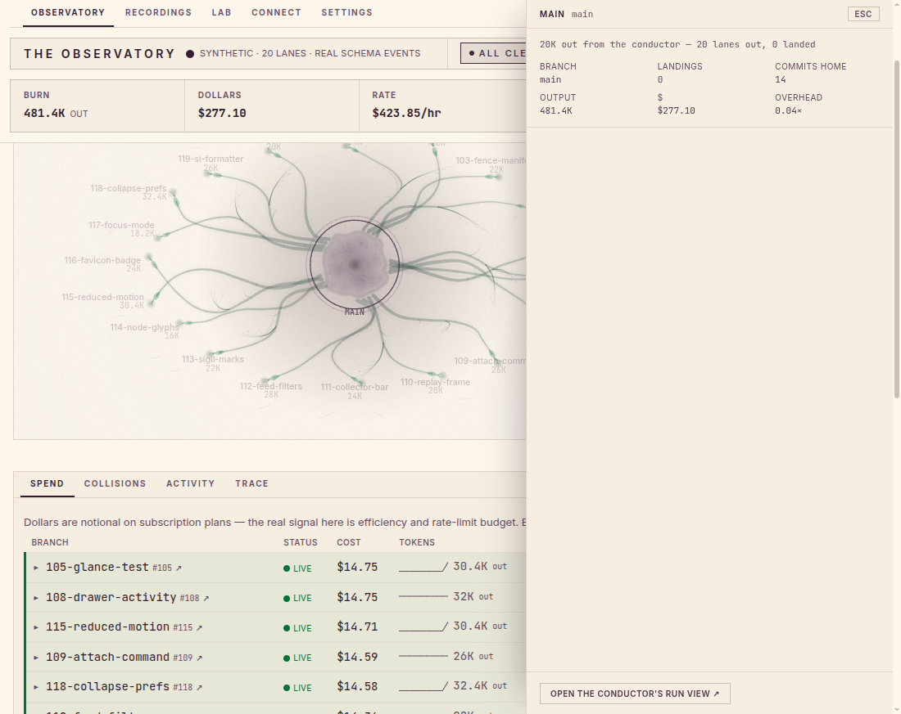

# The Rhizomorph

An instrument you point at a repo full of git worktrees: it shows what a
swarm of coding agents is doing, live, and can replay the session
afterward. Watching is read-only, absolutely; there is a separate, opt-in
second hand for running experiments — see [Trust](#trust) below for exactly
what each does and how that's enforced.



It discovers worktrees and branches (git), agent panes (tmux), and
[workmux](https://github.com/raine/workmux) state if present — each source
optional, each degrading gracefully — and reflects reality within a couple
of seconds via polling. This watching hand — collectors, receiver, server,
UI — never sends a keystroke, launches an agent, or merges anything; only
the separate, explicitly-invoked laboratory can do any of that, and only on
your own command. If you're deciding whether to run this on the machine
where your agents work, the next two sections are the ones that matter;
everything past them is depth for once you've decided.

New here? [`docs/user-guide/getting-started.md`](docs/user-guide/getting-started.md) walks clone → first dashboard in five minutes; the rest of `docs/user-guide/` covers watching, replay, sessions, the lab, and troubleshooting.

## Install and run

There's no published package (see
[When this is published to npm](#when-this-is-published-to-npm) below) —
cloning the repo is the install story. Four commands, on a plain terminal,
no undocumented steps:

```sh
git clone https://github.com/KelliherL/rhizomorph
cd rhizomorph
npm install
npm run build   # builds the dashboard once; the server serves it statically
npm start -- <path-to-repo>   # boots collectors + API on http://127.0.0.1:4321
```

Omit the path (just `npm start`) to watch the current directory instead of
some other repo. Either way it prints the URL it's listening on
(`http://127.0.0.1:4321` by default) — open it in a browser. To pass other
flags, forward them the same way: `npm start -- <path-to-repo> --port 5000`.

| Flag | Default | Meaning |
|---|---|---|
| `--port <n>` | `4321` | Port to listen on |
| `--flatline-minutes <n>` | `5` | Minutes of silence before an agent is flatlined |
| `--poll-interval <ms>` | `2000`, minimum `250` | Collector poll cadence in ms |
| `--extra-sessions <path>[:<lane>]` | — | Foreign Claude session-log dir to tail as a conductor (repeatable). `<path>` is the dir of `*.jsonl` itself; `<lane>` defaults to `conductor`, `conductor-2`, … |
| `--fresh` | — | Start a new session instead of resuming the most recent one for this repo (default: resume if its newest event is under 4h old) |
| `--resume-window <ms>` | 4h | Override the resume boundary above. `--resume-window 0` behaves exactly like `--fresh`. The boot line and `rhizomorph doctor` both say which way this decided and why |
| `--backfill` | — | Read session logs from the beginning instead of end-of-file — ingest history on purpose; expect a large first tick |
| `--help`, `-h` | — | Show usage and exit |

Not sure something's missing rather than actually broken? Run the one
command that explains every gap at once:

```sh
npm start -- doctor <path-to-repo>
```

It checks the Node version, that the target path exists and is a git repo,
that the web build is present, that the port is free, Claude Code session
logs, tmux/workmux on `PATH`, the telemetry env, the lane manifest, whether
this boot found a live writer already holding the session (the pid+heartbeat
lock, see [Trust](#trust) below), and each lane's own enrichment rung — one
`ok`/`warn`/`FAIL` line per check, each with its exact remedy. It exits
non-zero only when the app genuinely cannot run at all (bad path, not a git
repo, no web build, port already taken); everything else is a `warn` that
degrades gracefully rather than a reason to stop.

### When this is published to npm

Not yet true — flagged here so it reads as a stated future, not a command
you can run. There is no npm publish yet: the repo stays clonable instead,
and the release machinery stays dormant, not deleted. Right now, `npx
rhizomorph <path-to-repo>` 404s
(`npm error 404 'rhizomorph@*' is not in this registry`) — there is no
package to fetch. Once one is published, that single command will fetch and
run it with nothing installed permanently, no clone required — the same
code the clone path above runs today, just fewer steps to get there.

The plan, not a date: prd15's "true, full-featured system agnosticism" round
(any OS, any terminal, any agent CLI) supersedes the earlier clone-first
ruling and puts publishing back on the map — but deliberately as its **last**
wave, never its first, so agnosticism lands and gets exercised before a
stranger's `npm install` is the front door. prd8's packaging machinery
(tarball-proven `files` allowlist, tag-gated release workflow, no secrets)
already exists and stays dormant until that wave. The one remaining
prerequisite is an operator decision, not a build task: whether going public
means rewriting this repo's history or cutting a fresh tree, a choice #177
named and left open rather than resolved — the audit that raised it found
unscrubbed identifiers in captured OTel fixtures, and a scrub commit fixes
the tree, not the history it's layered on. No wave here promises a date.

## Trust

This is a tool that reads your machine's own record of what your coding
agents have been doing, so here is plainly what it does and doesn't do —
not a footnote, the second thing in this file. There are three hands here,
not one, each with its own reach and its own enforcing test — a single
blanket "read-only, never" claim would be weaker than this, not stronger,
because it would erase the one hand that's allowed to write anything and
leave the other two looking like they need no fence at all.

### The observer — everything below, absolutely read-only

Collectors, receiver, server and UI. This hand never writes to the repo
you're watching, never sends a keystroke to an agent, never starts or stops
one, and never merges or otherwise acts on what it shows you — enforced by
this repo's own readonly law tests, not just stated: the lane drawer's
[`packages/web/src/drawer/readonly.test.ts`](packages/web/src/drawer/readonly.test.ts)
greps its own source for any HTTP verb but GET, any way to build a request
body, any execution channel, any credential; the judge's
[`packages/server/src/judge/mergetree.test.ts`](packages/server/src/judge/mergetree.test.ts)
proves a speculative merge check leaves HEAD, every ref, and the working
tree byte-for-byte unchanged. Every other collector reads the same three
read-only sources (git, tmux/workmux, your own session logs) and writes
nothing back to any of them.

**What it reads:** the git state of the repo you point it at (worktrees,
branches, commits — read-only, no writes); tmux panes and
[workmux](https://github.com/raine/workmux) state, if either is installed
(neither is required); and, to show an agent's actual conversation in the
lane drawer, your own Claude Code session logs under `~/.claude/projects`.

**Where it listens:** `127.0.0.1` only, on the port you choose (default
`4321`). It does not bind a public interface. If you also point a live
`claude` process at its telemetry receiver (see [Telemetry](#telemetry-the-money-layer)
below), that receiver listens on the same loopback address, on the same
port, for the same reason.

**What it sends, and to whom:** nothing, ever, off this machine. There is
no analytics call, no update check, no phone-home of any kind anywhere in
this codebase. Everything it shows is read from local files and local
processes and rendered in your own browser.

### The recorder — the observer's own second hand, narrower than either (prd16 ruling 2)

Not a new authority: the observer has always written its own recording of
what it saw; what prd16 makes operable is *who decides when a recording
ends*. This hand may only ever close the current session log and open a
new one, writing solely inside the Rhizomorph's own data directory
(`~/.local/share/rhizomorph/<repo-slug>/`) — never the watched repo, never
a git ref, never a worktree, never `~/.claude`.

**When it records:** always, from the moment the server starts — there is
no opt-in flag and no way to run it without recording. What decides *when
one recording ends and the next begins* is your own explicit act, never a
collector, a lane, or a clock: `--fresh` forces a new session,
`--resume-window` sets how long a gap may be before the previous one counts
as over (default 4h; `--resume-window 0` behaves exactly like `--fresh`),
and the default resumes whatever session is still inside that window. Two
instances can no longer race onto the same log either: each boot claims a
pid+heartbeat lock beside the session (`session-<id>.lock.json`, refreshed
every 5s); a second instance finding a live lock starts its own fresh
session instead of splicing into a session another process is still
writing — [`packages/server/src/log/session-lock.ts`](packages/server/src/log/session-lock.ts),
proven in [`packages/server/src/log/session-log.test.ts`](packages/server/src/log/session-log.test.ts).
Every path this hand can write to is built from one function,
[`defaultDataRoot()`](packages/server/src/log/paths.ts) — there's no second
constructor for a session, label, snapshot or lock path to have drifted
from it.

**Ending a session on purpose:** `rhizomorph rotate`, or the dashboard's own
"end session · start fresh" button, asks the *running* instrument to close
its current log and open the next one — an explicit human invocation, never
something a background process performs on its own. On close, each lane's
live transcript is copied — redacted by the same hygiene discipline the
telemetry fixtures use — into that session's own artefact directory, so a
recording replayed in a year, on any machine, still shows its
conversations; replay reads the captured copy first and falls back to live
resolution only for the still-open session. A session whose transcripts
couldn't be fully captured says so precisely (`manifest.complete: false`)
rather than silently producing a conversation-less recording.

**What it writes:** its own recording of what it saw — a plain JSON-lines
session log under `~/.local/share/rhizomorph/<repo-slug>/`, one file per
session, never anything inside the repo you're watching. The log is
*exactly* the event stream every panel already reads: whatever privacy
allowlisting a collector applies happens before an event is even built, so
the log was never a second copy with more in it, and it never gains fields
after the fact. That's what makes Replay possible; delete the directory
and the next boot starts a fresh recording with nothing lost from the repo
itself. An event line from a future era this build doesn't recognize is
never silently dropped either — it's counted and preserved byte-for-byte,
and replay says so in words (`"N events from a newer era were preserved but
not understood (...)"`) rather than pretending nothing happened.

**Where it writes it:** the exact path is printed at boot —
`watching <repo> — N worktrees, M branches · recording to <path>` — so you
never have to go looking for it.

**Finding, labelling, managing and replaying a recording:** `rhizomorph
sessions [path]` lists every session recorded for a repo — newest first,
each with a title *derived from its own events* (`2026-08-04 · 6 lanes · 5
landed · #144 #148 #152`, or `2026-08-04 · no activity recorded` for an
empty one), when it ran, how long, lanes, landings, tokens, cost and file
size. The same rows, plus rename-in-place and export, live in the
dashboard's own **`/recordings`** library — a management surface, deliberately
never a second live overview: it renders only what was recorded, never the
live fleet, a law its own source-grep test
([`packages/web/src/recordings/no-live-fleet-law.test.ts`](packages/web/src/recordings/no-live-fleet-law.test.ts))
holds it to. If an auto-title isn't the name you'd give it, rename it there
or run `rhizomorph label <sessionId> "<text>"` — either way it's written to
a sidecar file next to the log (`session-<id>.label.json`), never a
mutation of the log itself, and a rename refreshes every picker showing
that session, including the live dashboard's own. Once you've found the one
you want, either replay it from the dashboard's own picker, or hand the
file to someone else first with `rhizomorph export-record` (see [the record
format](docs/record-format.md)).

### The laboratory — opt-in, explicitly-invoked, and separate (prd12 ruling 1)

Everything above runs the moment you start the server. The laboratory does
not: it's a second actor, reachable only from your own command line —
`rhizomorph lab checkpoint <lane>`, `rhizomorph lab fork <lane>
[--at <checkpoint>] [--launch]`, `rhizomorph lab compare <forkId>` — never
from a server route, a background poll, or a UI button. `checkpoint`
snapshots a lane's live workspace and session position; `fork` restores as
many arms of one checkpoint as you ask for, each into its own worktree, and
runs `npm install` in each one; `compare` reports what happened across
them.

What it's allowed to write, exactly: refs under `refs/rhizomorph/`, the git
objects those refs require, worktrees it creates itself under
`~/.local/share/rhizomorph/lab/worktrees/` (a sibling of the recording
directory above, never inside the repo you're watching), and the
checkpoint/synthesized-session artifacts that live beside it. It never
pushes, never merges, and never checks out or rewrites a branch that
already exists. The one write that lands outside those namespaces is never
silent or automatic: pass `lab fork --launch` and it hands the dispatch off
to `workmux add`, the same command that starts every other worker lane in a
workmux-driven fleet — that call is what creates an actual branch and tmux
pane, and it only runs because you typed the flag. Without `--launch`,
`fork` says so plainly: *"No tmux window was opened and no branch was
created... Pass --launch to authorise that yourself."*

Enforced twice over. At runtime,
[`assertInsideLabWorktrees`](packages/server/src/lab/paths.ts) refuses —
unconditionally, not just in a test — any worktree path the lab tries to
create outside its own directory. And
[`packages/server/src/lab/namespace-law.test.ts`](packages/server/src/lab/namespace-law.test.ts)
is the test that watches everything else: no source file outside
`server/src/lab/` may even import it, except the one declared CLI wiring
point; no ref literal in its source names anything but `refs/rhizomorph/`;
no lab file shells out to `push`, `merge`, `checkout`, `branch`, `reset`,
`rebase`, or any other verb that rewrites something that already exists;
nothing under `lab/` sets a timer of its own, so "never runs without your
command" holds structurally, not just by convention; and a live run of
`lab fork` against a real fixture repo proves the whole write surface by
walking the filesystem and the ref namespace before and after, rather than
trusting the source to say so.

If you'd rather verify that yourself than take it on faith — the right
instinct for exactly this kind of tool — the source is right here: the
collectors that read git/tmux/workmux live under
`packages/server/src/collectors/`, the one that tails your session logs is
`packages/server/src/collectors/sessionlog/`, the server that binds the
port is `packages/server/src/index.ts`, and the laboratory's entire write
surface is `packages/server/src/lab/`, reachable only from the CLI wiring
in `packages/server/src/cli/index.ts`. Grep for `fetch(`, `http.request`,
or any outbound socket; there isn't one.

## Support matrix

| Platform | Status |
|---|---|
| Linux | CI-verified on every push (`.github/workflows/ci.yml`) |
| WSL | The daily development platform — exercised constantly, just not by CI |
| macOS | **Unverified.** No platform-specific code exists (paths go through `node:path`, collectors degrade loudly rather than fail silently), but nobody has run it on macOS and confirmed that. Treat it as untested, not as "should work." If you try it, [an issue](https://github.com/KelliherL/rhizomorph/issues) saying what happened is genuinely useful. |

**Node >= 22** — enforced via `engines` in `package.json`; older Node warns
on install and may not run at all.

## What the observer does not do

Read-only is the whole point for this hand, not a caveat — see
["The laboratory"](#trust) above for the one deliberately different hand,
what it's allowed to write instead, and how that's fenced:

- It never writes to the repo it's watching — no commits, no branches, no
  file changes.
- It never runs a git command that mutates anything (no merge, no rebase,
  no checkout, no push) — only read commands like `git worktree list`,
  `git log`, `git status`.
- It never sends a keystroke to an agent, never starts one, never stops one.
- It never merges a worktree or otherwise acts on what it shows you. The
  lane drawer's **ATTACH** button copies a `tmux`/`workmux` command to your
  clipboard; it never runs it. Every action after that is yours, in your
  own terminal.

## Maintenance

Released as-is. Issues are welcome, but there's no promise of response
times — this is a solo project maintained alongside everything else in
life, not a supported product with an SLA. If something's broken, file an
issue with what you ran and what happened; if you'd like to fix it
yourself, see [CONTRIBUTING.md](CONTRIBUTING.md).

3,158 tests across 202 files (`npm test`), plus `npm run typecheck`, gate
every change — [Ran] as of commit `24dcaa5`. Two scripts encode the landing
discipline that keeps that green: `scripts/fence-lint.sh` checks a wave's
declared issue fences *before* dispatch (vague fences, overlapping claims,
gaps against a known coupling point); `scripts/gate.sh` is what a lane runs
to land — fence compliance, a clean rebase, no NUL bytes, `npm test` +
`npm run typecheck` green (optionally repeated under concurrent load to
catch race-condition flakiness), then the actual merge to `main`.

---

Everything below this line is depth for once you've decided to run it:
what the picture on screen means, how replay works, the keyboard map, and
where the rest of the documentation lives.

## Prerequisites, restated

- **git.** The Rhizomorph watches a git working tree; the directory you
  point it at (default: cwd) must be one.
- **tmux — optional.** Without it, agent-status detection stays quiet (one
  `collector.disabled` event) and the fleet table, scene, and collisions
  panel all keep working off git alone.
- **[workmux](https://github.com/raine/workmux) — optional.** Without it,
  the same graceful degradation applies to workmux-specific state (lane
  labels, pane↔worktree wiring, the WAITING pathology); nothing else is
  affected.

Neither tmux nor workmux is required to see a working dashboard — `doctor`
(above) tells you exactly which of these are missing and what that costs.

## First run, nothing else set up

Point it at a fresh clone of some other repo — no worktrees beyond `main`,
no tmux session, no telemetry configured — and here's exactly what you get,
not a placeholder:

- The **attention strip** at the top reads `ALL CLEAR`, with an evidence
  line ("0 lanes · 0 branches · 0 files checked · collisions 0") rather than
  bare reassurance — every figure in it is something the fleet object
  already checked. `main` itself isn't a lane (a lane is a dispatched
  worktree), which is why a fresh clone with nothing but `main` checked out
  reads as zero.
- The **burn strip** shows `0` output tokens and the gap-voice line `NO COST
  FEED (OTel) — dollars unavailable — run: eval "$(rhizomorph env <lane>)"`
  in place of a dollar figure, plus `CONDUCTOR NOT INSTRUMENTED` in place of
  an overhead ratio.
- The **scene**, the first thing under the two docked strips, shows a single
  lit mass (`main`) with nothing reaching out from it, and the **fleet
  table** right beneath it shows no rows at all — nothing dispatched yet.
- The **ledger** and **collisions** panel stay at their own honest-empty
  states ("collisions: 0 — checked 0 branches / 0 files") until something
  commits or two branches touch the same file.
- The **provenance bar** along the bottom shows one dot per collector (Git,
  Tmux, Workmux, Sessionlog, OTel) plus the SSE stream dot — a dot dims when
  its collector is disabled (nothing to report) and glows the broken hue when
  it's erroring, so "nothing to report" never looks like "something's
  wrong."

None of that is a bug — it's `doctor`'s job (above) to tell "nothing to
report" apart from "something's actually wrong."

## Telemetry (the money layer)

Point a real `claude` process at this Rhizomorph's built-in OTLP receiver and
its spend shows up live in the burn strip and the fleet table's `$` column.
Every lane needs `CLAUDE_CODE_ENABLE_TELEMETRY=1`, an OTLP/HTTP JSON
exporter aimed at the running server, and an
`OTEL_RESOURCE_ATTRIBUTES=lane=<handle>,role=<worker|conductor|auxiliary>,instance=<id>`
tag so the event lands on the right row — the receiver refuses any export
that doesn't carry the instance id of the Rhizomorph it's meant for. With
the server already running (`env` reads that id from `/api/meta`, so it
refuses to print a block for a port nothing is listening on), get the exact,
export-ready block for any lane with:

```sh
npm start --silent -- env <lane> [--role worker|conductor|auxiliary|unattributed] [--port <n>]
eval "$(npm start --silent -- env test-lane)"   # then launch claude in the same shell
```

(`--silent` is npm's flag, not rhizomorph's — it just keeps npm's own
`> rhizomorph@0.1.0 start` banner out of the block that `eval` reads;
without it, `eval` chokes on that first line.)

`.workmux.yaml` already wires this into every worker lane automatically —
nothing to enable by hand for a worker. A conductor, or any lane whose Claude
Code session-log directory lives outside the worktrees this repo's
`sessionlog` collector would otherwise discover (a cross-filesystem or
cross-machine conductor, say), is picked up with the repeatable
`--extra-sessions <dir>` flag and attributed `role: conductor` automatically.
Full walkthrough — the cross-machine note, the subscription-dollars honesty
note, live proof of the `OTEL_RESOURCE_ATTRIBUTES` lane tag — lives in
[`docs/telemetry.md`](docs/telemetry.md).

## Performance

Two numbers a stranger loading a real recording would otherwise hit blind,
both measured on this project's own build-day sessions and fixed rather than
merely noticed:

- **Loading a long replay: ~20.9s of blocked main thread → ~25ms.** A 55,000-
  event session used to fold onto the page as 55,000 synchronous `setState`
  calls before the tab became interactive — 62 long tasks, over 224 seconds
  of blocking, one single task past 31 seconds, zero animation frames
  sampled while it ran. `useEventStream` now buffers incoming events and
  folds once per animation frame instead
  ([`packages/web/src/hooks/useEventStream.ts`](packages/web/src/hooks/useEventStream.ts),
  issue #183) — the same 55k-row session now costs ~25ms of main-thread work.
- **A 30-lane fleet with 200 retired scars, inside the 60fps frame budget.**
  Before caching, building that scene's display list cost 28.37ms/frame —
  170.2% of the 16.7ms a 60fps frame allows, well over budget. After caching
  the parts of a scar that don't change frame to frame, the same scene costs
  11.95ms — 71.7% of budget, comfortably inside it
  ([`packages/web/src/scene/perf.test.ts`](packages/web/src/scene/perf.test.ts),
  issues #175/#178) — a real, currently-running assertion, not a one-time
  measurement quoted from memory.

## Architecture

Event-sourced core (`packages/core`), collectors + Fastify API + CLI
(`packages/server`), and a React + Tailwind dashboard (`packages/web`)
sharing one set of selectors between the live view and replay, plus one
derived **fleet object** — the attention strip, fleet table, burn strip and
scene are four views of it and of nothing else. The scene itself is a
hand-rolled canvas 2D painter, not a 3D library — prd7 measured the running
scene already locked to 60fps with zero `shadowBlur` calls, found "janky"
was the form language rather than the renderer, and removed the
react-three-fiber dependency it was originally scaffolded on. Full write-up
in [`docs/architecture.md`](docs/architecture.md); the product brief is in
[`docs/prd0.md`](docs/prd0.md), the visualization design rulings in
[`docs/prd3.md`](docs/prd3.md) and [`docs/prd4.md`](docs/prd4.md). See
[`docs/demo.md`](docs/demo.md) for the falsifiable demo script.

## Dashboard

The curated, top-to-bottom hierarchy ([ruling 6](docs/prd3.md), reordered by
[prd4 ruling 2](docs/prd4.md)) answers, in order: *does anything need me* →
*what is it costing* → *what is the fleet doing* → *who is doing what* →
*what happened* → *where did this come from*. The scene moved up to third
place, directly under the two docked strips: it's big, bright and
self-explanatory, so a first-time viewer reads it before the reference
instruments beneath it.

- **Attention strip** (docked top) — calm state is `ALL CLEAR` with an
  evidence line (lanes · branches · files checked · collisions); alert state
  is `N NEED ATTENTION` with up to four named, click-to-jump chips (lane +
  why + how long), `+N` beyond that. At `NEEDS-YOU` and above the browser
  tab itself flips (`● N need you`, favicon swaps color) so the signal
  survives a background tab.
- **Burn strip** (docked top, beside the attention strip) — four numbers, no
  chrome: output tokens, dollars (once an `llm.cost` event is authoritative),
  burn rate, and the conductor/worker overhead ratio. Any missing piece
  speaks the gap voice instead of guessing (`NO COST FEED (OTel) — …`,
  `CONDUCTOR NOT INSTRUMENTED — …`).
- **Scene** (the centerpiece, [prd4 ruling 2](docs/prd4.md)) — the mycelium
  pulse-network ([ruling 28](docs/prd3.md)): root-mass at the center, one
  tendril per lane, pulses of light traveling along them for real events
  (commits, token bursts) — never invented, never on history. Four channels,
  each a different fact, none of them a decoration:
  - **Thread width — how much a lane has produced**, on an absolute scale
    ([prd6 ruling 1](docs/prd6.md)): a 20K-token lane draws the same width
    whether it's alone or next to a 500K-token whale. Nothing balloons — the
    scale is capped.
  - **Distance from the mass — how far through its life a lane is**
    ([prd6 ruling 4](docs/prd6.md)): born close in, growing outward as it
    works, coming to rest at the rim when it retires. No legend needed —
    "closer to the middle" reads as "newer" on its own.
  - **Angle — identity**, stable for the whole session (a lane keeps its
    slot on the ring no matter how its status changes).
  - **Brightness — recency**: how long ago a lane last did something,
    independent of how far through its life it is.

  Looping, frozen, waiting, expensive, and off-fence lanes each read as an
  unmistakably different *shape* on their thread, not a color alone (see
  "The palette" below). It's also a place you can go: drag to pan, Ctrl/Cmd
  + wheel to zoom at the cursor, and a finished lane cuts loose from the
  mass rather than sitting there dyed a different color — see "The camera"
  and "The cord-cut" below. The root-mass itself is clickable: it opens the
  same drawer a lane does, on the conductor's own conversation. Lazy-loaded
  behind an error boundary: if it breaks, the rest of the panel grid stands
  alone. A "Focus Scene" button fills the whole viewport with it.
- **Fleet table** — one dense row per lane: state, output tokens, `$`,
  request/tool counts, thread/subagent count, age, and fence status. The
  STATE column draws the scene's own glyph *and* the scene's own hue at row
  scale, so this table is the scene's legend for both shape and color — no
  separate key needed to read the picture above it. Its own footer names
  three keyboard verbs: `n`/`Shift+n` jumps the shared selection to the
  next/previous lane that needs you, `f` focuses the table full-screen, and
  `a` copies that lane's attach command — see "Keyboard reference" below
  for the full set, scene included.
- **Ledger** — the deep per-branch/thread spend table the burn strip
  summarizes; cost and token totals, model, first/last seen, elapsed.
- **Collisions** — demoted to calm chrome until it matters: a real collision
  escalates straight to the attention strip, and the panel's own empty state
  carries evidence (`collisions: 0 — checked N branches / M files`) rather
  than bare reassurance.
- **Activity feed** — commits, landings, lane starts/stops, and collector
  events in one quiet, filterable-by-kind-and-by-lane stream.
- **Provenance bar** (docked bottom) — one dot per collector (Git, Tmux,
  Workmux, Sessionlog, OTel) plus the SSE connection dot; a dead collector
  escalates to the strip too, and speaks the same gap voice here.
- **Lane drawer** — click any fleet row to open it. Vitals (state, output,
  cost, age, fence, worktree) sit fixed above one tabbed body that gets the
  drawer's full height rather than four independently-scrolling boxes —
  **ACTIVITY, CONVERSATION, WHY, TRACE**, in that order, opening on ACTIVITY
  by default (an operator ruling: the activity ledger tells you whether the
  conversation is worth reading before you commit to it). **CONVERSATION**
  is the same thing you'd see sitting at that agent's own terminal — user
  turns marked with a `›` prompt, assistant prose in the page's own type,
  tool calls as quiet one-line bullets between them (`● Read — path/to/file`,
  `⎿ result, …+2K more` when a result was cut) — tailing the session log live
  and pausing (and saying so) once you scroll up. It caches the last-good
  page it read per lane, so switching back to one you've already opened
  resumes instantly instead of re-showing a loading frame, and a transient
  gap from the server (an absent/error tick) never blanks a conversation
  that's already on screen — it holds what it has and marks it `stale ▪`
  rather than erasing it. **WHY** names every file this lane has touched
  against its declared fence, a click-through back into ACTIVITY's own
  reading of the trespass. **TRACE** is the beta waterfall (see
  [`docs/telemetry.md`](docs/telemetry.md#enabling-beta-traces)) when spans
  are wired in, an honest gap otherwise. Below all of it, an **ATTACH**
  button that copies the exact `tmux`/`workmux` command for that lane to
  your clipboard — it never runs anything; interaction happens in your own
  terminal. Closing it (**Esc**, or the drawer's own close) always takes
  precedence over exiting panel focus. **Click the root-mass and the same
  drawer opens on the conductor** — the same frame, the same tabs, the same
  copies-never-executes ATTACH, just with main's own vitals up top (branch,
  worktrees landed, commits observed on it) instead of a lane's. An
  un-instrumented conductor says so in the gap voice rather than showing an
  empty pane.
- **Panel focus** — every panel has a "Focus" affordance that fills the view
  with just that panel; **Esc** restores it. No drag/resize/custom layouts.
- **Replay** — a full mode shift, not a tinted live view: the attention strip
  is replaced outright by a REPLAY banner (timestamp, session identity, an
  "Exit to live" button) in an ice-register frame, never a ladder hue, so a
  recording can never be mistaken for a live summons. The replay bar has a
  one-click **"Replay this session's birth"** button — it picks the recorded
  session with the most history and jumps straight into playback — plus a
  session dropdown and speed control (1x/4x/16x); live and replay share one
  reducer, so every panel above freezes to the scrubbed instant exactly as it
  would live. The dropdown names each session by its title — an operator
  label if one was set (`rhizomorph label`), else the auto-title
  `rhizomorph sessions` also shows — never a bare timestamp you'd have to
  decode.

  Underneath the transport sits **the dock** (prd13, cut to its final shape
  by ruling 13): a sparse **chapter-mark lane** above the scrubber, one mark
  per lane-born/landed/gate-held/summons/session-boundary moment, coalescing
  into a `×N` count under density the same way everything else in this app
  coalesces rather than invents. Hover a mark (or a cluster) for a portaled
  card — mounted straight to `document.body` rather than nested in place,
  so no ancestor's clipping or stacking context can bury or cut it off —
  naming who/what/when for every member. `Shift`+wheel zooms the mark lane about the *cursor's own
  timestamp*, never the whole scrubbable range (that stays full-width
  always); `[`/`]` step to the neighbouring chapter. What prd13 shipped and
  then walked back: a per-lane density band (state-fill strips, a row per
  lane) was cut outright on 2026-08-06 — *"get rid of the working green
  strips entirely"* — because it still read as noise to the one person using
  it after three rounds of fixes. What's left is exactly the marks, the axis,
  and the transport; nothing else. See [`docs/demo.md`](docs/demo.md) for the
  full replay check.

### The palette — the fleet table teaches it, the scene speaks it

Every state gets a real color, not just a glyph. Six hues, each meaning
exactly one thing everywhere in the app:

| Hue | Means | Where you'll see it |
|---|---|---|
| Green | Productive | `WORKING` (bright) and `done` (dimmer) — the same green at two brightnesses |
| Amber | Blocked on a human | `waiting` (muted, benign) and `NEEDS-YOU`/`WAITING` pathology (incandescent) — again one scale, two brightnesses |
| Red | Dead | `FROZEN` only — red never means anything softer than that |
| Cyan | Notice/anomaly | `EXPENSIVE`'s needle taper and the licks coming off it — something changed, nobody is summoned |
| Ice (blue-grey) | Structure, nothing to say | `idle`, `unknown`, and all of the chrome |

You don't need this table to read the app: the **fleet table's STATE column
is the legend**, in both senses. It draws the scene's own glyph (a coil for
LOOPING, a severed bar for FROZEN, a raised hand for WAITING, a radial burst
for EXPENSIVE, fence posts and a barb for OFF-FENCE) at row scale next to the
plain-English word, in the same hue the scene paints that lane's thread with.

Brightness, not color exclusivity, is what marks an alarm: a calm lane may
wear its hue at a healthy brightness (no more "too dark to read" fleet), but
only a `NEEDS-YOU`/`FROZEN` mark reaches the band of luminance above it — so
a summons is always the brightest thing on the screen, never merely "also
colored." One lane at a time takes the spotlight; every other lane recedes
around it rather than being drowned in more color.

### The organic form — ribbons, taper, and the centre that melts

A thread is a **filled ribbon whose width varies along its own length**,
not a stroked centre-line with glyphs glued onto it:

- **Width is still work** — a thicker ribbon has produced more, on the same
  absolute, capped scale as thread width above. Every ribbon narrows a
  little from where it leaves the root-mass to where it ends, the way a
  real hypha does.
- **Taper is EXPENSIVE.** A lane burning far above the fleet's median draws
  its last stretch down to a needle, plus three short ribbons peeling away
  from the tip like heat leaving it.
- **Pinch is FROZEN.** A dead lane's ribbon narrows to nothing at two points
  along its own length — the thread is genuinely cut in two places.
- **A fold at the tip is done.** A finished lane's cord runs past its node,
  turns back on itself near its own width, and comes home into the lens —
  no two lanes fold quite alike, since the fold's reach, tightness, and bow
  all come off that lane's own name.
- **Swell is a commit, and swell is the way home.** A commit rides as a
  travelling widening in the ribbon's own girth — matter moving through the
  hypha — and the same channel carries a finished lane's substance home: one
  last swell runs down the severing cord into the root-mass before the
  freed end springs back.
- **Length is lifecycle** — how far a thread reaches from the mass is how
  far through its life that lane is.

**The centre is one surface**, not a stack of rings — several soft fields
blended together and walked into one closed contour. It bulges toward
whichever lane's work is arriving, swelling as that lane's cord parts, and
settles back once the merge is done, leaving only the mass a little thicker
than before. **It grows with the session's landed work**: every lane whose
cord has been cut has sent its substance back down the thread, so the mass
is visibly bigger by the end of a night than at the start — the honest
reading of a merge, the work is part of `main` now. The cap is absolute and
bounded to half the distance from the centre to the nearest point of the
retirement band, so the mass can never crowd the rim or the lane labels at
any zoom; what a fuller mass gains is interior structure (more layers
resolved between the skin and the core), not a bigger silhouette relative to
its own likeness.

**Every lane looks hand-grown, and no lane misreads.** A thread also wanders
a little off the straight line between the mass and its node, and its width
wobbles by a few percent along its length, so twenty lanes never look like
twenty copies of the same drafted arc. That variation is seeded from a hash
of **the lane's own name**, never from the clock, so it can only ever add a
stable, private wiggle — it never touches where a thread sits on its
lifecycle, what hue it wears, or how wide it's encoded to be. The practical
result: the same lane, in the same session, draws the same shape every time
you look at it and every time you replay the recording — on your machine or
on someone else's.

| | |
|---|---|
|  |  |

### Parked lanes — acknowledged, never hidden

Sometimes a worktree is deliberately shelved rather than abandoned — a
spike, an idea kept for later — and the Rhizomorph needs to say so without
treating it as a bug. An operator (never this read-only instrument) declares
that by adding `"parked": true` to that lane's entry in `.swarm/lanes.json`:

```json
{
  "version": 1,
  "lanes": [
    { "handle": "60-shelved-idea", "branch": "60-shelved-idea", "fence": ["packages/web/src/panels/shelved/**"], "parked": true }
  ]
}
```

A parked lane renders a dimmed `PARKED` in the fleet table's STATE column —
visible, never hidden — and is exempt from the FROZEN and inferred-WAITING
alarms and skipped by the attention ladder, since silence in a lane you
parked on purpose isn't news. Everything else about it (output, cost, age,
fence compliance) keeps reading its real telemetry: parked mutes the alarm,
never the evidence.

### The camera — drag, zoom, and a way home

The scene is a place you navigate, not a picture that sits still. Click or
tab into it first — the keys below are scoped to a focused scene, on
purpose (see "Keyboard reference"):

- **Drag** (left or middle button) pans.
- **Ctrl/Cmd + scroll** zooms at the pointer — the point under your cursor
  stays under it. A trackpad pinch arrives the same way (it's a ctrlKey
  wheel stream under the hood), so pinch-to-zoom works with no separate
  handling.
- **A plain scroll is not the camera's** — the scene sits in a page you can
  scroll past, so an unmodified wheel scrolls the page exactly as if the
  canvas weren't there.
- **`1`** zooms to fit the whole network in view; **`0`** resets to the
  start position; **`+`/`-`** step the zoom. The same four actions sit as
  on-canvas buttons bottom-right (**−**, **+**, **Fit**, **Reset**), so a
  trackpad-only reader never needs the keyboard.
- **Recenter** fades in automatically, in the same corner, whenever you've
  panned or zoomed the network out of view entirely — a click brings it
  back.
- The zoom range is deliberately bounded (0.4×–6×): further out and the
  threads go sub-pixel; further in and you're looking at a gradient, not a
  network.

### The cord-cut — a finished lane leaves the network, honestly

When a lane finishes — workmux declares it `done`, or its worktree is
removed — its thread doesn't just change color. It **cuts loose**: the
thread goes slack at the root, the freed end springs back toward its own
node, and what's left settles into a small, permanently dimmed **scar** near
the rim, carrying the lane's name and its output figure for the rest of the
session. It's a roughly 1.4-second sequence, not a jump-cut, so you can
watch a lane stand down rather than just noticing it vanished.

- **A scar never disappears, and it keeps its size** — a lane that did more
  work leaves a visibly bigger scar. It's dim, well below a living lane's
  floor, but never zero, because invisible completion looks exactly like a
  bug. The fleet table still lists the lane too; only the scene's own
  picture is affected by anything below.
- **Hide finished** (top-right of the scene) toggles scars out of the
  picture if a long session has accumulated a lot of them — it always shows
  its own count (`Hide finished · 12`), so "hidden" never reads as "gone,"
  and it's remembered across reloads. Hiding a scar never shrinks the
  root-mass back down — the work still happened.

A lane you've parked on purpose scars the same way, just without the
animation — there's no "moment" a standing declaration can play back.

### Germinating seeds — a returning lane grows from where it left off

Dispatch the same handle again after it's retired — a re-dispatch, not a new
lane — and its thread doesn't sprout from a stranger's spot on the other
side of the ring. It **germinates from its own dormant seed**: same angle,
same seat, and it starts already as big as the seed it grew from, because
the worker returning is the same one that did that earlier work.

### Motion, pause, and reduced motion

The scene breathes gently and pulses on real events, but every bit of that
motion is budgeted, not decorative — ambient motion (the root-mass's slow
breath) stays under 3%, event motion (a pulse for a commit or a token burst)
caps at five moving at once and folds overflow into one pulse carrying a
count, and structural motion (a lane appearing, reflowing, or cutting loose)
never bounces.

**Pause motion** (top-left of the scene) stops all of that outright — every
ambient and event animation freezes at the instant you press it, and it
says so in words (`Motion paused`), not just by looking different. If your
system is set to reduce motion (`prefers-reduced-motion`), the scene keeps
every color and brightness change but drops travel and scale on its own,
with no button needed.

### Amber ages with attention

A `NEEDS-YOU` chip in the attention strip tells you *how long* it's been
true, and that duration changes how insistent it reads — quieter right when
it fires, full brightness past two minutes, a slow deliberate pulse past
ten. What never changes is *which rung* it's on — age makes the same fault
read more urgently, it never promotes a lane to a worse one.

### Keyboard reference

Three independent registers, scoped by *where* you are rather than one
global keymap — a key means one thing while the scene has focus and can
mean something else everywhere else on the page:

| Key | Scope | What it does |
|---|---|---|
| `1` / `2` / `3` | Page (scene unfocused) | Switch the driving log: live / 20-lane fixture / pathology fixture |
| `1` | Scene (focused) | Zoom to fit the whole network |
| `0` | Scene (focused) | Reset the camera |
| `+` / `-` | Scene (focused) | Step the zoom in/out |
| `n` / `Shift+n` | Page (global) | Jump the shared selection to the next/previous lane that needs you |
| `f` | Fleet table (a lane in hand) | Focus the fleet table full-screen |
| `a` | Fleet table (a lane in hand) | Copy that lane's tmux/workmux attach command |
| `Esc` | Page (global) | Close the lane drawer, then exit panel focus — never both at once |

Click the scene once, or tab to it, to put the first three rows in scope;
click anywhere else (or press Esc) to give `1`/`2`/`3` back to the page.
Every key here is ignored while you're typing into a form field.

| | |
|---|---|
|  |  |
|  |  |
|  |  |
|  | |

A note on the header: the app itself still shows the wordmark **THE
OBSERVATORY** on screen — the project's original name, kept there as a
design element. The package, the CLI, and the command are all `rhizomorph`;
only that one piece of on-screen chrome hasn't caught up, on purpose.

## The build-day context

This repo is also the build log for a day of running several coding agents
across git worktrees at once — the Rhizomorph is the app that day built,
and its first real subject was its own construction. `docs/` has the full
decision record: [`docs/vision.md`](docs/vision.md) for the pitch,
[`docs/architecture.md`](docs/architecture.md) for how it's built and why,
and the numbered `docs/prd*.md` files for the rulings behind each stage.

## License

[MIT](LICENSE)
