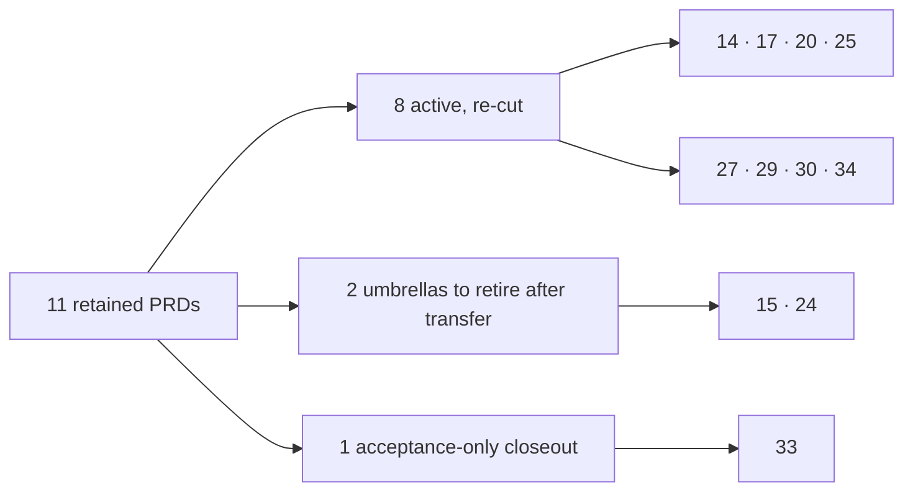
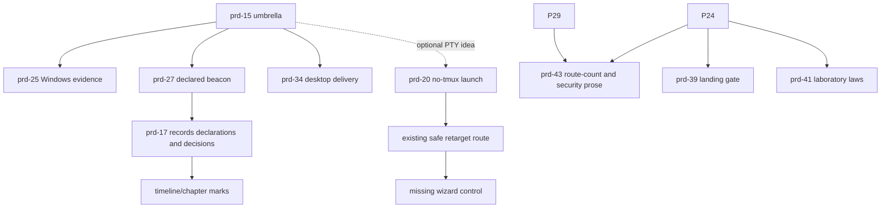
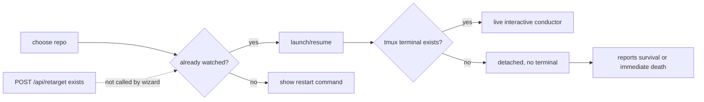
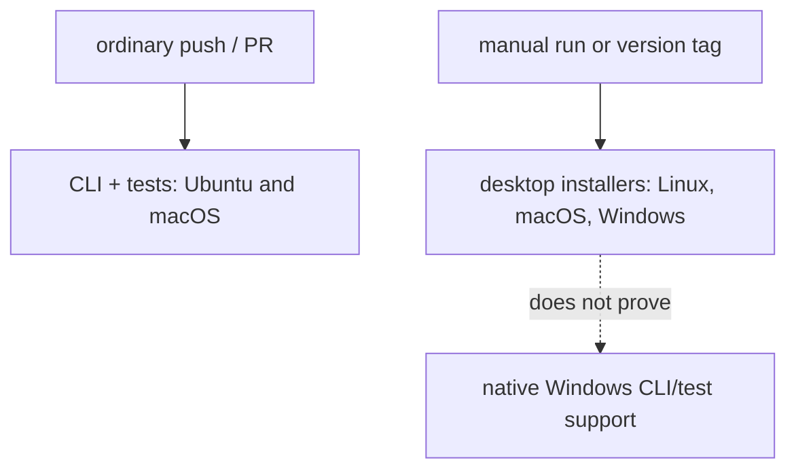
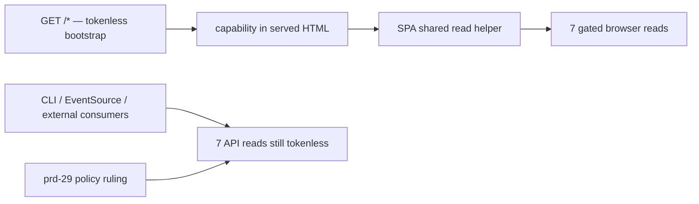
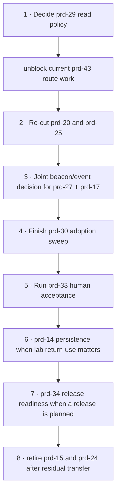

# The eleven retained PRDs — code-backed disposition review

- **Reviewed:** 2026-08-22
- **Product-code baseline:** `03df141` (`origin/main` when the reconciliation began)
- **Paper baseline:** `0572e36` (the current branch adds prd-39–43 and reconciliation documents)
**Scope:** prd-14, 15, 17, 20, 24, 25, 27, 29, 30, 33 and 34

## Executive recommendation

The first reconciliation was deliberately conservative: it left eleven PRDs in the active
directory whenever any requirement, ruling or acceptance act appeared unfinished. A closer code
audit changes the recommendation for several of them. “Some words remain open” is not, by itself,
a reason to keep a whole PRD active.

| PRD | Plain-English subject | Recommendation | Why |
|---|---|---|---|
| [14](prd-14-experiment-console.md) | Run and compare laboratory experiments | **Keep, but cut to one small persistence slice** | The browser experiment flow ships; saving and reopening a finished comparison does not. |
| [15](prd-15-anywhere-instrument.md) | Work without depending on tmux, one OS or one agent CLI | **Retire the umbrella after extracting two optional ideas** | Its central no-tmux/non-Claude honesty outcome is now demonstrated by the transcript organ and Pi adapter. Windows, beacons and desktop delivery already have successor PRDs. |
| [17](prd-17-complete-record.md) | Record Rhizomorph’s judgements and the operator’s decisions | **Keep and re-cut** | Record-integrity laws ship, but the important judgement/decision event families and their timeline marks do not. |
| [20](prd-20-the-concierge.md) | Get from a repo choice to a working instrumented conductor | **Keep and re-cut around two user journeys** | The safe retarget engine exists but the wizard does not call it; a no-tmux one-click launch still lacks a real terminal. |
| [24](prd-24-the-seam-that-lies.md) | Make tests prove the seams and scopes they claim to prove | **Transfer the remaining findings, then retire this umbrella** | Much shipped; prd-39, 41 and 43 now own large parts of the original audit, while ADR-0026 reverses its Playwright exclusion. A few concrete gaps remain and must not be lost. |
| [25](prd-25-the-third-platform.md) | Make native Windows support continuously testable | **Keep; bless a smaller current plan** | The Windows boot bug was fixed and desktop packaging targets Windows, but the main CLI/test/pack gate still has no Windows leg. |
| [27](prd-27-the-declared-voice.md) | Distinguish declared facts from inference and expose stale instrumentation | **Keep and re-cut after three decisions** | The explanation vocabulary and false-summons protection ship; hook beacons, lapse handling and build-vs-watched-code staleness do not. |
| [29](prd-29-the-identity-seam.md) | Decide which local reads require the boot capability | **Keep as a decision PRD; decide it next** | Seven browser-only reads are gated. Seven other reads remain tokenless, and the unresolved policy blocks prd-43’s route-truth work. |
| [30](prd-30-the-open-hand.md) | Make every mark explain itself consistently by hover and focus | **Keep, but only for adoption and acceptance** | The shared card and condition selector ship, but the code itself admits the old card idioms and tooltip sweep remain. The preliminary “implementation complete” label was too optimistic. |
| [33](prd-33-the-living-scene.md) | Keep the scene lively without making it misleading or slow | **Run the human glance test, then move to done** | Growth, material, ambient laws and recorded frame measurements ship. The remaining gate is the deliberately human first-glance exercise. |
| [34](prd-34-the-doorstep.md) | Ship the existing instrument as a desktop application | **Keep as a narrow release-readiness PRD** | The shell, tray, first run and three-platform installer workflow ship. Signing and the update feed were consciously deferred; a real Windows installer run and release decision remain. |

That produces this portfolio rather than eleven equally active programmes:



## What “keep”, “retire” and “acceptance-only” mean here

- **Keep and re-cut** means the problem is still real, but the historic wave list is not a safe
  backlog. Amend the PRD with the current remainder, then groom only that remainder.
- **Retire after transfer** means the umbrella is no longer the clearest owner. Preserve its
  decisions and citations, move any real residual into an explicit successor, then put the PRD in
  `done/` as superseded. It does not mean the old work was a mistake.
- **Acceptance-only** means there is no justified implementation issue yet. Perform the named
  human or release check; create a defect only for an observed failure.

## Relationship between the eleven

Several apparently separate PRDs meet at one missing seam. Treating them as eleven independent
backlogs would duplicate work.



## prd-14 — the experiment console

### What it covers

prd-14 is the human-facing side of the laboratory. It lets an operator select a checkpoint, run
multiple experimental arms, see every run, compare spread rather than a misleading single score,
and confirm estimated spend before launch.

### Why it was kept

The main experiment-console outcome is implemented, but ruling 3 also promises that a finished
comparison can be saved, found later and reopened. The current code defines an artifact format but
does not connect it to the recording library.

The implementation says this directly in
[`packages/web/src/lab/compare/artifact.ts`](../../packages/web/src/lab/compare/artifact.ts),
lines 3–7:

```ts
/**
 * A FINISHED COMPARISON, SAVED AS A REOPENABLE ARTIFACT ...
 * A pure serialise/parse pair ... — not
 * wired to prd16's recording machinery yet ...
 */
```

`serialiseComparison()` and `parseComparisonArtifact()` are exported and tested, but production
searches find no save action, storage route, recording-library row or reopen path using them. That
is a genuine missing user capability, not merely an out-of-date status label.

### What is already done

- The laboratory has a browser route and separate visual grammar.
- Arms may differ freely; the report explains confounding rather than blocking exploration.
- Individual runs and spread are shown.
- Spend is estimated and confirmed before launch.
- The comparison format is versioned and defensively parsed.

Key implementation areas:

- [`packages/web/src/lab/`](../../packages/web/src/lab/)
- [`packages/web/src/lab/compare/`](../../packages/web/src/lab/compare/)
- [`packages/server/src/api/lab.ts`](../../packages/server/src/api/lab.ts)
- [`packages/server/src/lab/`](../../packages/server/src/lab/)

### Recommendation

**Keep, but replace the old multi-wave plan with one bounded persistence/reopen slice.** The next
decision should say where a comparison artifact lives, how it appears in the existing recordings
library, and how an old version refuses or migrates. Do not reopen the shipped layout, arm, spread
or estimate work.

Priority is moderate: the missing path affects returning to an experiment, not running one now.

## prd-15 — the anywhere instrument

### What it covers

prd-15 was the broad system-agnosticism programme: no mandatory tmux, honest capability reporting,
multiple agent dialects, Windows evidence, an optional PTY wrapper, multi-orchestrator honesty and
eventual easy distribution.

### Why it was kept

The preliminary reconciliation found two clauses that still live only here: multi-orchestrator
presentation and the optional `rhizomorph run <cmd>` PTY tier. The core ladder also explicitly says
that L2 and L3 have no collectors yet.

The central no-tmux organ is unquestionably present. See
[`packages/server/src/collectors/sessionlog/lane-state.ts`](../../packages/server/src/collectors/sessionlog/lane-state.ts),
lines 4–25:

```ts
/**
 * Lane liveness and attention ... No tmux, no workmux,
 * no hooks, no cooperation from the agent, no terminal ...
 *
 * | working | waiting | frozen | gone |
 */
```

The remaining ladder gap is also explicit in
[`packages/core/src/collector.ts`](../../packages/core/src/collector.ts), lines 257–263:

```text
`L2` (beacon) and `L3` (PTY wrapper) aren't reachable by any
collector in this repo yet
```

### What is already done

- The transcript-tail state machine supplies liveness and inferred attention without tmux.
- Every collector has the six-signal capability vocabulary.
- The UI and doctor can state a rung and explain how to climb it.
- prd-26 delivered Pi as a real second observation dialect. Its capability declaration supplies
  identity, liveness, activity, telemetry and authoritative cost, with attention honestly marked
  partial rather than silently guessed.
- Windows is now separately and more precisely owned by prd-25.
- Hook beacons are owned by prd-27.
- Desktop delivery is owned by prd-34.

### What remains

- Multi-orchestrator presentation and collision handling.
- The optional PTY observation/launch tier.
- Some old sequencing text that points at successor work as if it still belonged here.

Neither residual is necessary to prove the PRD’s stated central Success scenario: a no-tmux,
non-Claude run where every signal is present or honestly absent. Pi plus the capability vocabulary
now demonstrates that shape. The residuals are optional product expansions, not evidence that the
whole umbrella must stay active forever.

### Recommendation

**Retire prd-15 as a completed/superseded umbrella after preserving two small follow-ups.** Record an
amendment that names prd-25, 27 and 34 as successors. Put multi-orchestrator honesty in its own
proposal only if current product evidence still calls for it. Fold the PTY question into prd-20’s
no-tmux launch work, or park it as a technical option rather than a promised wave.

Keeping prd-15 active now obscures ownership: nearly every meaningful remaining clause already has
a better home.

## prd-17 — the complete record

### What it covers

prd-17 makes two actors visible in the event log: Rhizomorph itself, when it judges that attention
is needed or a gate held, and the operator, when they acknowledge, decide or annotate. It also
protects old recordings from newer event types and defines how replay ordering works.

### Why it was kept

Most integrity machinery shipped, including lenient parsing, the era corpus, an upcast seam,
`session.closed`, and fsync on close. The central product dividend did not: the event union still
does not contain `summons.raised`, `summons.cleared`, `gate.verdict`, `dispatch.brief`,
`fence.declared`, `operator.ack`, `operator.verdict` or `operator.note`.

[`packages/core/src/events/index.ts`](../../packages/core/src/events/index.ts), lines 53–98, is the
authoritative event list. It contains system, collector, telemetry, lab and judge events, but none
of those decision families.

The timeline explains the consequence in
[`packages/web/src/tide/chapters.ts`](../../packages/web/src/tide/chapters.ts), lines 14–18 and
40–46:

```text
Ruling 12 names five candidate moments ... Four have a
clean, self-attributing event behind them; the fifth does not ...

**`attention-summons onset` has no event.**
```

### What is already done

- Unknown newer events are counted and voiced instead of silently discarded.
- A golden recording corpus is folded in CI.
- `session.closed` is a real final event and close is flushed/fsynced.
- Replay now has append-order laws.

The last point means the PRD’s old “fold-order remains unruled” wording should be reconciled against
the current replay laws before grooming. The code is ahead of that sentence.

### What remains

- The instrument-judgement event family.
- Explicit operator-decision events.
- Dispatch/fence/gate events and any content sidecars.
- Beacon ingestion shared with prd-27.
- Chapter/timeline marks backed by those events.

### Recommendation

**Keep and re-cut.** First write one amendment that confirms current append-order authority and
states which beacon/event doorway is shared with prd-27. Then groom a minimal event-first wave;
timeline rendering follows only after the events exist. This PRD still describes distinct,
valuable product truth not owned by prd-39–43.

## prd-20 — the concierge

### What it covers

prd-20 is the “get me working” path: discover or clone a repo, choose a supported conductor,
launch or resume it with instrumentation, migrate continuity safely, and prove data is flowing.
It also owns switching the one watched repo in place.

### Why it was kept

The server-side retarget is complete and careful. The route validates before changing anything,
suspends polling, closes and opens the recording boundary, repoints the live context, resets the
collectors and reports the telemetry cost. That sequence is documented in
[`packages/server/src/api/retarget.ts`](../../packages/server/src/api/retarget.ts), lines 14–52.

The browser wizard is stale relative to that implementation. It still says retarget is unbuilt and
withholds the launch button for a selected repo that is not already watched:

```tsx
{target} is not the repo this instrument is watching, and this hand cannot retarget one —
switching the watched repo is prd-20’s own open question and is not built.
```

Source: [`packages/web/src/connect/wizard.tsx`](../../packages/web/src/connect/wizard.tsx), lines
750–760.

There is a second user-journey gap. The server can launch into a real tmux window, but on a machine
without tmux it spawns the interactive CLI detached with no terminal. The code now waits and tells
the truth if the process dies; it does not provide the promised one-click interactive launch. See
[`packages/server/src/concierge/launch.ts`](../../packages/server/src/concierge/launch.ts), especially
`tryTmuxLaunch()`, `describeDeath()` and `runDetachedLaunch()`.

### Current flow



### What is already done

- Fourth-hand ADR and capability gating.
- Harness registry and honest capability catalogue.
- Local repo discovery and clone-by-URL.
- Safe launch/relaunch planning and transcript migration.
- Safe retarget engine and cross-repo recording pointers.
- `/connect` wizard and verification rows.
- Honest immediate-death detection for detached launches.

### Recommendation

**Keep, with exactly two current outcomes:**

1. The wizard can invoke the existing retarget route, show its consequences, and then continue the
   same setup journey in the newly watched repo.
2. A no-tmux one-click launch either receives a real terminal (probably a PTY/ConPTY solution) or
   the product explicitly narrows the promise to a copyable manual command.

Remove the old open question about rotate-vs-respawn; the implemented route has already settled it.
prd-42 may harden path identity around the route, but it does not implement either user journey.

## prd-24 — the seam that lies

### What it covers

prd-24 is a testing-trust audit: browser and server contracts must meet in at least one real test;
law tests must walk the full scope they claim; a regression test must be capable of failing for its
stated reason; and “green” must say which platforms actually ran.

### Why it was kept

Substantial parts shipped. `packages/contract` now drives real web clients against a real Fastify
app, and its coverage law reads the actual client enumeration. The intent is stated in
[`packages/contract/src/contract-coverage-law.test.ts`](../../packages/contract/src/contract-coverage-law.test.ts),
lines 6–18:

```text
the requirement to have a contract test is itself a law ...
this law asserts every entry there has a contract test HERE —
by declared enumeration, not ambition
```

But the original PRD is no longer a clean programme:

- prd-39 owns the landing gate’s own false-positive checks.
- prd-41 owns specific laboratory containment and law gaps.
- prd-43 owns documentation claims that should be executable.
- [ADR-0026](../adr/0026-the-shell-is-driven-by-playwright-not-certified-by-hand.md) accepts
  Playwright for the shell, superseding prd-24’s categorical “no browser harness” position.

### Concrete residuals that still exist

Do not retire the PRD without transferring these:

1. **The recordings law still walks only one directory level.**
   [`packages/web/src/recordings/no-live-fleet-law.test.ts`](../../packages/web/src/recordings/no-live-fleet-law.test.ts),
   lines 30–35, uses a flat `readdirSync(RECORDINGS_DIR)`. A nested source file can escape the law.
2. **CI still skips later checks after a failed test.**
   [`.github/workflows/ci.yml`](../../.github/workflows/ci.yml), lines 60–70, runs Build → Test →
   Typecheck → Lint as ordinary sequential steps. A red Test prevents the later evidence from being
   produced on that leg.
3. **The read-side contract policy is incomplete.** This intersects prd-29 and must follow its
   ruling rather than guessing which reads are supposed to be gated.
4. **Falsification/mutation evidence remains mainly a working practice, not a consistently checked
   mechanism.** The current AGENTS.md review questions help, but they do not retroactively prove
   every old law bites.

### Recommendation

**Transfer the four residuals, then retire prd-24 as superseded.** The best home may be a small
post-prd-39–43 test-trust PRD, or explicit new waves in a current owner where the fence already
belongs. Do not reopen the original audit sequence and do not duplicate prd-39/41/43 issues.

Until that transfer is written, leave prd-24 in the root: immediate removal would hide real gaps.

## prd-25 — the third platform

### What it covers

prd-25 is native Windows evidence for the CLI and observer: a built clone boots, the pack/install
path works, platform failures are named rather than rediscovered, and the support matrix is backed
by a continuously running artifact.

### Why it was kept

The original Windows boot defect is fixed. The bin now imports a built absolute path through a file
URL:

```js
const { runCli } = useDist
  ? await import(pathToFileURL(distEntry).href)
  : await (await import('tsx/esm/api')).tsImport(srcEntryRelative, import.meta.url)
```

Source: [`packages/server/bin/rhizomorph.mjs`](../../packages/server/bin/rhizomorph.mjs), lines
51–53.

However, the main CI matrices still contain only Ubuntu and macOS. The Windows row in
`.github/workflows/desktop.yml` proves that the Electron packaging definition targets Windows; it
does not run the native CLI suite or the installed-CLI pack smoke on every push.



### What is already done

- The drive-letter dynamic-import boot defect is fixed with `pathToFileURL`.
- PowerShell/cmd environment output exists.
- The desktop packaging workflow includes `windows-latest`.
- Windows-sensitive process-probe code names unsupported evidence honestly.

### What remains

- A Windows `pack-smoke` or equivalent continuous boot artifact.
- A policy for known native-Windows test failures: expected-fail, skip-list, or fix-before-green.
- Fixture line-ending policy and a repeatable native suite result.
- A support-matrix row derived from the evidence rather than optimism.
- A decision about CI cost and whether ConPTY belongs in this PRD or prd-20.

### Recommendation

**Keep and bless a smaller plan.** Start with the cheapest artifact that witnesses the fixed bug:
a Windows pack/install/boot smoke. Only then decide whether to move the full suite onto Windows and
how to make pre-existing failures visible without normalising new ones. This is current, bounded
and not covered by the desktop installer workflow.

## prd-27 — the declared voice

### What it covers

prd-27 upgrades “Rhizomorph inferred this” to “the harness declared this” where a hook can say so,
and makes every condition explain why it believes a fact, what evidence is stale, and what would
make the reading stronger.

### Why it was kept

The render-side vocabulary is real. The total condition selector explains every lane state with
evidence and a remedy; see
[`packages/core/src/selectors/condition.ts`](../../packages/core/src/selectors/condition.ts), lines
5–42. The false-summons protection is structural in the transcript-tail organ.

The declaration source is not real yet. The core ladder still says L2 beacon is unreachable, and
the sessionlog collector still reports attention as inferred with the remedy “a hook beacon would
declare it.” No beacon collector or hook event source is registered.

The other missing success is code/data staleness: there is no first-class state saying “this server
was built at X but is watching packages at Y,” nor a matching doctor/UI remedy. Some local version
checks exist for CLI fixture compatibility; they are not this product-level mismatch.

### What is already done

- A shared label/why/evidence/remedy vocabulary.
- A total lane-condition selector.
- Honest `provided`/`partial`/`absent` capability details.
- The #133 rule that a still pane plus live telemetry must not raise a false summons.
- Rendering support for unknown evidence and stronger-rung guidance.

### Decisions still required

1. Where hook beacons enter: watched file drop or another existing door.
2. How long silence makes a previously live beacon “lapsed.”
3. Whether configured-but-silent reads `partial` or `absent`, and how disagreement with transcript
   inference renders.

### Recommendation

**Keep and re-cut after those three decisions.** Share one event/ingestion design with prd-17;
otherwise the two PRDs will invent competing beacon formats. Keep build-vs-watched-code staleness as
a separate wave because it needs no hook mechanism and can deliver value independently.

## prd-29 — the identity seam

### What it covers

prd-29 does not claim to protect against every local process. Its narrower job is to make sensitive
local API reads consistently require the per-boot capability where that can be done without
breaking the browser bootstrap, CLI tools or server-sent events.

### Why it was kept

Wave 1 shipped correctly:

- `gated-read` is a fourth route class.
- Seven browser-only reads require the capability.
- The route law proves a gated row actually carries the gate.
- `capabilityRead()` attaches the token at the SPA’s shared read seam.

The authoritative table in
[`packages/server/src/api/index.ts`](../../packages/server/src/api/index.ts), lines 120–153,
still has seven tokenless API reads: meta, stream, lane index (two routes), session preview, doctor
and concierge repo discovery. The static `GET /*` bootstrap is intentionally tokenless forever.



The unresolved question is not whether gating code can be written. It is which external consumers
may scrape the in-band token, whether SSE should use a read-only cookie, and which newer routes
should remain deliberately public on loopback.

### Recommendation

**Keep as a decision PRD and rule it before more route documentation work.** Update the old “ten API
reads” arithmetic to the current 25-route table first. Then make a route-by-route decision for the
seven remaining API reads. prd-43 can derive truthful counts only after this policy stops moving.

This should be the first decision among the retained PRDs because it directly unblocks part of the
already-live prd-43 programme.

## prd-30 — the open hand
### What it covers

prd-30 creates one explanation pattern for a visual mark: the same label, why, evidence and remedy
on hover, keyboard focus and touch, with optional deeper evidence rather than a separate tutorial.

### Why it was kept — and why the first reconciliation was too optimistic

The shared implementation is strong:

- `Disclosure` supplies hover/focus/touch interaction.
- `DisclosureCard` renders the one label/why/remedy order.
- `selectLaneCondition()` is total and evidence-backed.
- The teach affordance expands the same evidence on demand.

But the code’s own law explicitly says the adoption is unfinished. In
[`packages/web/src/disclosure/one-card-law.test.ts`](../../packages/web/src/disclosure/one-card-law.test.ts),
lines 14–26:

```ts
`MarkHoverCard` ... and the loupe read-out are shipped card chrome in
other directories right now, and re-seating them is wave 3's work ...
When wave 3 retires the three idioms, the same test widens ...
```

Production search confirms both `MarkHoverCard` and `Loupe` still exist, along with many native
`title=` explanations. The current law is intentionally narrower than prd-30’s own success
criterion. Therefore the preliminary claim that four of five criteria were complete should not be
used to close the PRD.

### Recommendation

**Keep, but limit it to adoption plus acceptance.** Groom the sweep by directory so it remains
reviewable: re-seat `MarkHoverCard`, then the loupe, then the semantic `title=` population. Not every
HTML `title` must necessarily become a rich card; the amendment should distinguish a meaningful
condition/explanation from a simple control hint before counting work.

After the full-scope law has an empty allowlist, run the first-glance exercise. If that passes, move
prd-30 to `done`; if it fails, file only the observed comprehension defect.

## prd-33 — the living scene

### What it covers

prd-33 adds growth, organic material, ambient depth and controlled vibrancy to the observatory scene
without allowing decoration to encode status or consume the alarm salience band.

### Why it was kept

The document still named frame measurement and the human glance gate as open. The deeper audit found
that the frame evidence does exist. The scene performance test records before/after measurements and
reports the live 30-lane frame against a 16.67 ms budget.

[`packages/web/src/scene/perf.test.ts`](../../packages/web/src/scene/perf.test.ts), lines 53–67,
records one measured round:

```text
whole frame, 30 lanes + 2 cuts: 5.109ms before, 7.499ms after
60 fps budget: 16.67ms
```

The live test continues to report median, worst, mark count and stage breakdown at lines 475–497.
Growth has its own typed motion class, ambient channels are structurally tested, and the later
seven-event cap is the accepted successor to the older five-event sentence.

### What remains

Only the deliberately non-automated glance protocol is clearly unfulfilled: show the defined
fixtures to a real first-time viewer, collect the answers, and turn each failure into a cut,
explanation or focused defect.

### Recommendation

**Do not create another scene implementation backlog now. Run the human glance test, record the
result, then move prd-33 to `done` if it passes.** If it fails, file only what the person actually
misread. Also correct the PRD Outcome line so it no longer says frame measurement is absent.

## prd-34 — the doorstep

### What it covers

prd-34 packages the existing server and SPA as desktop software: embedded Electron window, server
supervision, tray lifecycle, first-run demo/configuration, installers, signing and safe updates.

### Why it was kept — and the correction to the preliminary reconciliation

The earlier reconciliation said installers and automatic-update groundwork were absent. That is no
longer a fair reading of the tree.

The desktop installer workflow has an explicit Linux/macOS/Windows matrix and packages with a pinned
electron-builder version:

```yaml
matrix:
  include:
    - { os: ubuntu-latest, platform: linux }
    - { os: macos-latest, platform: mac }
    - { os: windows-latest, platform: win }
```

Source: [`.github/workflows/desktop.yml`](../../.github/workflows/desktop.yml), lines 24–105. It
also uploads installers and checksums later in the same file.

The shell itself includes:

- server supervision and loopback-only window loading;
- tray, close-to-tray, explicit quit and launch-on-login;
- a first-run demonstration fleet and “watch my own repo” route;
- four configurable notification types and a badge derived from the same fleet;
- a no-fork law preventing a second server or React UI inside the shell;
- signing configuration as an explicit switch;
- an updater state machine and a hard refusal to relaunch automatically.

Signing and an update feed are not accidentally missing; ruling 9 deliberately deferred them. The
code reports that state honestly in
[`packages/app/src/host/update-gate.ts`](../../packages/app/src/host/update-gate.ts), lines 28–53:

```ts
export const UNAVAILABLE_REASON =
  'no update feed is configured — builds ship unsigned while signing is deferred ...'
```

### What remains

- Evidence that a produced Windows installer completes the whole stranger-run path on a real
  machine, with an actual measured time for Success 1.
- A release decision: remain unsigned with documented warnings, or fund/configure signing.
- If signing is enabled, a real update feed and release-channel decision.
- Confirmation that the workflow has produced usable artifacts, not merely that the YAML can ask
  for them.

The original Success 3 (“updates arrive signed, on by default”) conflicts with later ruling 9
(signing deferred). The later ruling is the current decision, so the Success section needs an
explicit amendment rather than being left permanently impossible.

### Recommendation

**Keep, but reclassify it as release readiness rather than unfinished shell construction.** Amend
Success 3 to reflect ruling 9, run one unsigned installer release candidate across the three
platform jobs, and perform the Windows first-run exercise. If there is no near-term public desktop
release, park signing/feed activation rather than keeping a permanently active feature wave.

Do not create issues to rebuild the shell, tray, first-run or installer workflow; those are present.
prd-43’s install-identity corrections are adjacent documentation work, not a replacement for this
release check.

## Recommended order of operations



In practical terms:

1. **Rule prd-29 first.** It is the only retained PRD presently blocking an issue in the blessed
   prd-39–43 programme.
2. **Bless the user-facing gaps next:** prd-20’s repo switch/launch journey and prd-25’s cheapest
   Windows gate.
3. **Make one shared beacon decision** before either prd-17 or prd-27 creates event work.
4. **Complete the visibly unfinished adoption sweep in prd-30.**
5. **Perform, rather than backlog, prd-33’s human acceptance.**
6. Schedule prd-14 and prd-34 according to actual product/release intent.
7. Retire prd-15 and prd-24 only after their still-useful residuals have named homes.

## Changes this review recommends to the PRD corpus

This document makes recommendations; it does not silently perform the moves. The follow-up paper
change should:

- amend prd-15 as completed/superseded and move it to `done/` after the PTY and
  multi-orchestrator dispositions are recorded;
- amend prd-24 as superseded and move it to `done/` after its four concrete residuals are assigned;
- correct prd-30’s Outcome from “implementation shipped” to “shared core shipped; adoption sweep
  remains”;
- correct prd-33’s Outcome to say frame measurement exists and only human glance acceptance remains;
- correct prd-34’s Outcome to say installers, tray, first-run and updater gating exist, while signing,
  feed activation and real-machine release acceptance remain;
- remove prd-20’s stale retarget-semantics open question;
- reconcile prd-17’s fold-order wording with the current append-order replay laws;
- update the [2026-08-22 reconciliation](reconciliation-2026-08-22.md) so its short table points to
  this deeper review for the revised dispositions.

No GitHub issue should be created from the historic wave lists. Once the operator accepts these
dispositions, issue grooming should start from the small current outcomes above, with current file
fences and dependencies.
